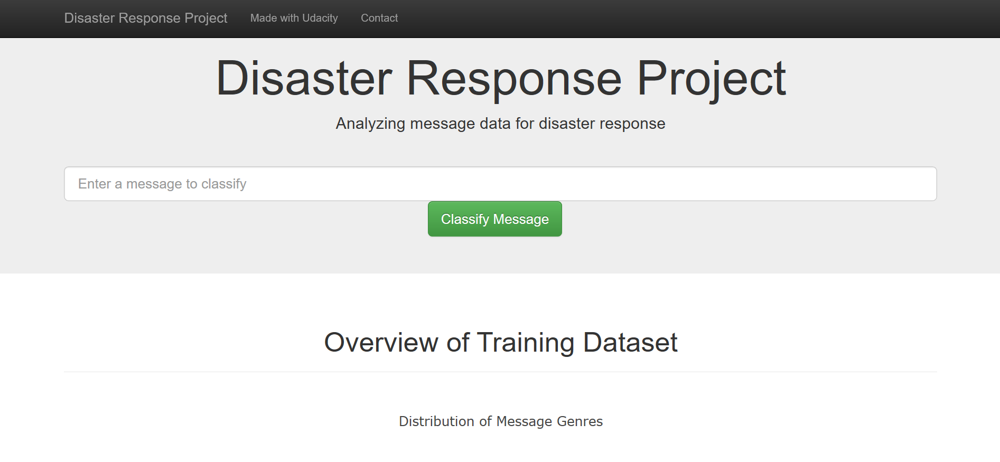

# Disaster Message Classification Project: Helping During Crisis

This project aims to build a system to categorize messages sent during disasters. Imagine a situation where people are affected by a natural disaster and need help. This project aims to streamline the process of getting them the assistance they need by automatically classifying their messages into 36 different categories, such as "Aid Related," "Medical Help," and "Search and Rescue."

## Here's how it works:

1.Data Collection and Cleaning: We'll start by acquiring and preparing a real-world dataset of disaster messages provided by Figure Eight: https://www.figure-eight.com/. This process involves cleaning and organizing the data for analysis.

2.Building the Machine Learning Model: We'll then build a machine learning model that can analyze a message and automatically assign it to the most relevant category (or categories) out of the 36 predefined ones. This is a complex task called "multi-label classification" as a single message might be relevant to multiple categories.

3.Developing a Web Application: Finally, we'll create a user-friendly web application where anyone can submit a disaster message and receive the predicted category classifications. This will help individuals and organizations better understand the needs expressed in the messages and provide the most appropriate assistance.

This project brings together various aspects of data science and technology to create a system that can potentially aid in organizing and responding to disaster situations more effectively.

## File Description
~~~~~~~
        disaster_response_pipeline
          |-- app
                |-- templates
                        |-- go.html
                        |-- master.html
                |-- run.py
          |-- data
                |-- disaster_message.csv
                |-- disaster_categories.csv
                |-- DisasterResponse.db
                |-- process_data.py
          |-- models
                |-- classifier.pkl
                |-- train_classifier.py
          |-- Preparation
                |-- categories.csv
                |-- ETL Pipeline Preparation.ipynb
                |-- ETL_Preparation.db
                |-- messages.csv
                |-- ML Pipeline Preparation.ipynb
                |-- README
          |-- README
~~~~~~~
## Requirements
This project requires Python 3 and several libraries:

1.numpy
2.pandas
3.sqlalchemy
4.re
5.NLTK
6.pickle
7.sklearn
8.plotly
9.flask

## Project Structure
The project is organized into several folders:

1.App folder: Contains the web application code, including templates and the main script (run.py).

2.Data folder: Stores the raw data files (disaster_messages.csv, disaster_categories.csv) and a database (DisasterResponse.db) for processed data. Additionally, it contains a script (process_data.py) for cleaning and transferring data.

3.Models folder: Houses the trained machine learning model (classifier.pkl) and the script used for training it (train_classifier.py).

4.README file: Provides an overview of the project.

5.Preparation folder (optional): Contains files used during development but are not required to run the project.

## Getting Started

1.Setting Up:

    Ensure you have Python 3 installed along with the mentioned libraries. You can install them using pip install <library_name>.

    Open a terminal or command prompt and navigate to the project's root directory.

    Run the following commands to configure your environment:

        Clean and process data: python data/process_data.py data/disaster_messages.csv data/disaster_categories.csv data/DisasterResponse.db

        Train and save the model: python models/train_classifier.py data/DisasterResponse.db models/classifier.pkl

2.Running the Web App:

    Navigate to the app folder in your terminal.

    Run python run.py to start the application.

3.Accessing the Web App:

    Open your web browser and visit http://0.0.0.0:3001/ to interact with the app.

## Acknowledgements
A big thank you to Figure-8 (https://figureeight.com/) for providing the data for this project.
Special thanks to Udacity for offering this training opportunity.

## Licensing
Feel free to use this project's code, but please cite me, Udacity, and/or Figure-8 accordingly.
Here's the link for github repo : https://github.com/D-Sarthak/Disaster_Response_Pipeline

## Note: The Preparation folder is not essential for running the project.